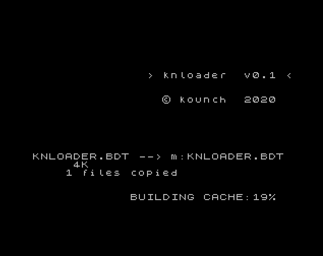
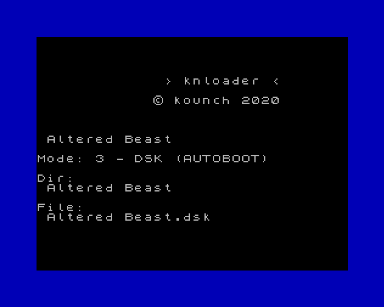
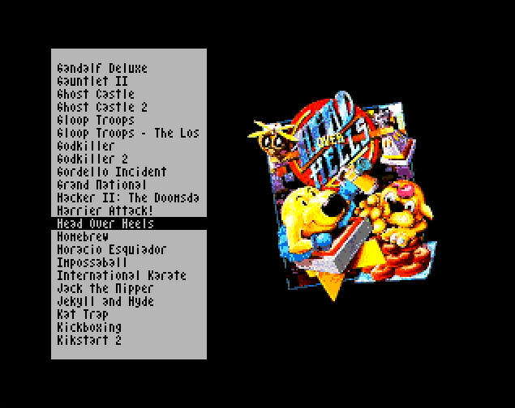

= knloader English Manual
:author: kounch
:revnumber: 1.0.0
:doctype: book
:email: kounch@users.noreply.github.com
:Revision: 1.0
:description: English Manual for knloader
:keywords: Manual, English, knloader, ZX Spectrum Next, BASIC, Launcher
:icons: font 
:toc: left
:toc-title: Index
:toclevels: 4

<<<

== Description

Do you have a ZX Spectrum Next, but you are tired to remember which is the best option to launch your programs? knloader to the rescue!

This a set of NextBASIC programs which you can configure to remember, and then use, your preferred way to launch other programs (Next/+3e Mode, 128K mode, USR 0, etc.). As a bonus, you can put some images (like cassette covers or loading screens).

These programs aren't a replacement for the incoportaded Browser, nor offer any other function than to launch other programs.

== Requirements

=== Download

A ZIP file with the latest version is available following https://github.com/kounch/knloader/releases/latest[this link].

=== Software Requirements

- *NextZXOS (version 1.3.2)*. Docs, downloads, etc. https://www.specnext.com/latestdistro/[here].

- *Python (version 3.6 or later)*, optionally, to use the included BDT and cache creation scripts. Docs, downloads, etc. https://www.python.org/[here].

== Installation

Create `knloader.bdt` file using the text editor of your choice or the included utility script and, optionally, create cache file(s) with the included utility (see below for more instructions).

Copy together `knloader.bas`, `knlauncher`, `knzml`, from one of the distribution language folders (`en` for english, `es` for spanish, etc.), and the new `knloader.bdt` or the cache file(s) to any place in your SD card.

== Use

Use the browser or command line to navigate to the folder where `knloader.bas`, `knlauncher`, `knzml` and `knloader.bdt` are. Load `knloader.bas`.

On first run, if they do not exist, cache files are created from the data inside database file `knloader.bdt`.

[.text-center] 

The main interface shows a list of the programs found in the database file.

[.text-center] 
image::CoverOff.png[pdfwidth=70%]

<<<

You can use the cursor keys or a joystick (Kempston or MD) to move and select the program that you want to load. Then, press `ENTER`, `0` or the joystick button to launch.

[.text-center] 

After a brief period of time, the program should load using the desired mode.

[.text-center] 
image::knlauncher.png[pdfwidth=70%]

<<<

If you have made a change to the database file, press R to rebuild the cache.

Press C or the joystick secondary button (in MD mode) to hide/show images.

[.text-center] 

Press A to enable/disable automatic save of the currently selected program position and the selection to show or hide images.

Press X or the third joystick button to exit the program.

Press H to show some help.

== Database file format

The main database is stored in a text file (ANSI encoding), named `knloader.bdt`, and which has to be in the same directory where `knloader.bas` is in the SD card. You can create manually the database file or using the included utility script `bdt_builder.py`.

BDT file size is limited to 16384 bytes when the cache files are created from within the ZX Spectrum Next. This limit disappears when the cache files are created externally, for example, using the utility script `cache_builder.py`.

All paths in the database file must use `/` (slash) as separator for directories. Using `\` (backslash) is not supported.

The first line has to be the base path where to start looking for programs (for example: `/games`). It's length cannot exceed 128 characters.

Starting from line 2, each line must have the following format:

[source]
----
Program Name,Loading Mode,<Directory>,File,<Image File>
----

Where each of the fields between ',' are as follows:

*`Program Name`*: Name to show in the interface (no commas `,` allowed)

*`Loading Mode`*: A number indicating how to load the program file. See the Table below

*`Directory`*: (Optional) Subdirectory where file and image file are located (maximum 64 characters, no commas `,` allowed)

*`File`*: Name of the file to execute (maximum 64 characters, no commas `,` allowed). If Mode 8 (DSK Custom Boot) is selected, it must have the name of both the DSK file and the file to load inside the disk image, separated by `:` (e.g. `Bounder.dsk:BOUNDER.BAS`)

*`Image File`*: (Optional) Name (maximum 64 characters, no commas `,` allowed) of a full screen image file to show behind the program listing. It can be in SCR, SLR, SHC, SL2 or BMP format. BMP file has to be 256x192 pixels, 256 colours (with Next palette and no colour space information).

<<<

=== Loading Mode Reference Codes

    0  - 3DOS (Next)
    1  - TAP
    2  - TZX (fast)
    3  - DSK (AUTOBOOT)
    4  - TAP (USR 0)
    5  - TZX (USR0 - Fast)
    6  - TAP (Next)
    7  - TZX (Next - Fast)
    8  - DSK (Custom Boot)
    9  - TAP (PI Audio)
    10 - TZX
    11 - TAP (USR 0 - PI Audio)
    12 - TZX (USR 0)
    13 - TAP (PI Audio - Next)
    14 - TZX (Next)
    15 - NEX (Next)
    16 - Snapshot
    17 - Z-Machine Program (Next)
    18 - 3DOS
    19 - TAP (48K)
    20 - TZX (48K - Fast)
    21 - TAP (48K - Pi Audio)
    22 - TZX (48K)
    23 - TAP (LOAD "" CODE)
    24 - TZX (LOAD "" CODE - Fast)
    25 - TAP (LOAD "" CODE - USR 0)
    26 - TZX (LOAD "" CODE - USR0 - Fast)
    27 - TAP (LOAD "" CODE - USR 0 - PI Audio)
    28 - TZX (LOAD "" CODE - USR 0)
    29 - TAP (LOAD "" CODE - 48K)
    30 - TZX (LOAD "" CODE - 48K - Fast)
    31 - TAP (LOAD "" CODE - PI Audio - 48K)
    32 - TZX (LOAD "" CODE - 48K)

[NOTE]
====
Unless stated otherwise (e.g. on modes 6,7), all modes set the ZX Spectrum Next in 128K mode, disabling Next special hardware.

All TZX (fast) modes run at 14Mhz. Once the program is loaded, you can get back to 3.5MHz speed using the NMI menu or pressing NMI and 8 at the same time.

Mode 3 (DSK AUTOBOOT) will mount the DSK file at drive `A:` and execute `LOAD "*"`.

Mode 8 (DSK Custom Boot) will mount the DSK file at drive `A:` and execute `LOAD "diskfile"`, where `diskfile` is obtained from the `File` field.
====

<<<

=== Examples

This are all valid lines:

[source]
----
Albatrossity,1,,Albatrossity.tap

Alter Ego,4,Alter Ego,Alter Ego.tap

Altered Beast,3,Altered Beast,Altered Beast.dsk,Altered Beast.bmp

Astronut,16,../Next/,Astronut.snx
----

But these are not:

[source]
----
Albatrossity,,,Albatrossity.tap
----

(missing Load Mode Code)

[source]
----
,1,,Albatrossity.tap
----

(missing Name)

[source]
----
Albatrossity,1,,
----

(Missing File)

<<<

This is an example of a small database file:

[source]
----
/all/Games
Albatrossity,1,,Albatrossity.tap
Alter Ego,4,Alter Ego,Alter Ego.tap
Altered Beast,3,Altered Beast,Altered Beast.dsk,Altered Beast.bmp
Amaurote,2,Amaurote,Amaurote.tzx
Aquanoids,5,Aquanoids,Aquanoids.tzx
Auf Wiedersehen Monty,10,Auf Wiedersehen Monty,Auf Wiedersehen Monty - 128k.tzx
Astronut,16,../Next/,Astronut.snx
Barbarian: The Ultimate Warrior,0,Barbarian/3DOS,BARB.BAS,../Barbarian.bmp
Batty,9,Batty,Batty.tap,
Bounder,8,Bounder,Bounder.dsk:BOUNDER.BAS
Hitchhiker's Guide to The Galaxy,17,../Z-Machine,hitchhiker-r60-s861002.z3
----

So, using this example, when you choose `Barbarian: The Ultimat` in the user interface, the program will try to load `/all/Games/Barbarian/3DOS/BARB.BAS`, and it will also try to show the image located at `/all/Games/Barbarian/Barbarian.bmp`.

== BDT Builder Script

This script tries to analyze all the contents of a directory (including subdirectories), finding ZX Spectrum Next files and images, and creates a new BDT file accordingly. Python (version 3.6 or later) is needed for it to run.

The script has a rudimentary intelligence and, when there are several files with the same name but different extensions (nex, snx, tap, etc.) it selects only one of them, following this priority:

    nex >  snx > tap > bas > dsk > p > tzx > z8 > z5 > z3 > z80

The default mode for each of these file types is as follows:

[cols=2] 
|===
|Extension|Mode
|`nex`|`15`
|`snx`|`16`
|`tap`|`1`
|`bas`|`0`
|`dsk`|`3`
|`p`|`16`
|`tzx`|`2`
|`z8`|`17`
|`z5`|`17`
|`z3`|`17`
|`z80`|`16`
|===

Also, when finding several image files with different extension, only one is selected using this priority:

    bmp > sl2 > scr > slr > shr > shc

Script usage: `python3 bdt_builder.py -i INPUT_PATH [-o OUTPUT_PATH] [-c SD_PATH] [--tap NUMBER] [--tzx NUMBER] [--bas NUMBER]`

Where `INPUT_PATH` is the path to the directory to analyze,`OUTPUT_PATH`, optionally, is the path to the new BDT file. If there is no output path argument, the BDT file is created in the current directory. Finally, `SD_PATH`, optionally, is the path in the SD where the programs are stored (first line of the BDT file). If no SD_PATH is provided, `OUTPUT_PATH` will be used.

By default, the script treats each found filename (without extension) as a different program to catalog. However you can change this behaviour to use the instead the name of the containing folder, and then take all the appropriate files inside as the same program, regardless of their name. To activate this feature, you must add `-t d` to the command, like this: `python3 bdt_builder.py -i INPUT_PATH -t d [-o OUTPUT_PATH] [-c SD_PATH]`

Also, the script orders by program name (lexicographically) all the results. If you want to order the results by file name (ASCII ordering), you can add the `-u` switch (e.g. `python3 bdt_builder.py -u -i INPUT_PATH ...`).

You can change the default loading mode for `tap`, `tzx` or `bas` extensions, using `--tap NUMBER`, `--tzx NUMBER` or `--bas NUMBER`, using the desired mode number. For example, to change loading mode for tap files to USR 0: `python3 bdt_builder.py -i INPUT_PATH --tap 4 ...`

After the BDT file is created, you can review and change its contents with a text editor, and then copy it to your SD card, next to where `knloader.bas` is, or you can create cache data (using the Cache Builder Script) and copy it to the SD card.

== Cache Builder Script

These programs use one or more cache files inside `/tmp/knloader` in the SD card. This is necessary to speed up program execution limitations. You can let `knloader.bas` create the cache data automatically for you on first run (or using the `R` key from within the program), or you can create externally the cache using the included `cache_builder.py` script. Python (version 3.6 or later) is needed for this script to be run.

One cache file is needed for each RAM memory bank (16K) that the program uses, and a maximum of 74 programs data can be stored in one bank. This means that, at most, 2590 programs can be managed with a base ZX Spectrum Next (1MiB of RAM) or 7326 when using an expanded configuration (2MiB of RAM).

Script usage: `python3 cache_builder.py -i INPUT_PATH [-o OUTPUT_PATH]`

Where `INPUT_PATH` is the path to the DBT file, and `OUTPUT_PATH`, optionally, is the directory path where the cache data will be created. If there is no output path argument, cache data is created in the current directory.

After the cache data files are created, you have to copy them to your SD card into `/tmp/knloader`.

== Autoexec NextBASIC program

Also included there is a small `autoexec.bas` that you can use to autostart knloader when the ZX Spectrum Next is started.

To install it, rename the file `/nextzxos/autoexec.bas` in the SD card to `/nextzxos/autoexec.bas.bak`, and then copy the file `autoexec.bas` from the `utils` folder into `/nextzxos` in the SD card. Copy also all the knloader files (`knloader.bas`, `knlauncher`, `knzml` and BDT file), from one of the distribution language folders (`en` for english, `es` for spanish, etc.), to a directory named `/knloader/` in the root of the SD card.

As an extra, you can use the following keys on startup to change the behaviour:

- Press `A` or the main joystick button (Kempston or MD mode) to start the original `autoexec.bas` that was renamed as `autoexec.bas.bak`
- Press Space or the secondary joystick button to start ZX Spectrum Next Browser instead of knloader

== Notes

These programs create a preferences file named `opts.tmp` inside the same folder where `knloader.bas` is installed.

== Copyright

Copyright (c) 2020 kounch

Some of the code used to launch programs has been adapted from the official NextZXOS distribution (especifically from `browser.cfg`, `tapload.bas` and `tzxload.bas`).

**_Spectrum Next_** and **_System/Next_** are © **SpecNext Ltd**.

Permission to use, copy, modify, and/or distribute this software for any purpose with or without fee is hereby granted, provided that the above copyright notice and this permission notice appear in all copies.

THE SOFTWARE IS PROVIDED "AS IS" AND THE AUTHOR DISCLAIMS ALL WARRANTIES WITH REGARD TO THIS SOFTWARE INCLUDING ALL IMPLIED WARRANTIES OF MERCHANTABILITY AND FITNESS. IN NO EVENT SHALL THE AUTHOR BE LIABLE FOR ANY SPECIAL, DIRECT, INDIRECT, OR CONSEQUENTIAL DAMAGES OR ANY DAMAGES WHATSOEVER RESULTING FROM LOSS OF USE, DATA OR PROFITS, WHETHER IN AN ACTION OF CONTRACT, NEGLIGENCE OR OTHER TORTIOUS ACTION, ARISING OUT OF OR IN CONNECTION WITH THE USE OR PERFORMANCE OF THIS SOFTWARE
